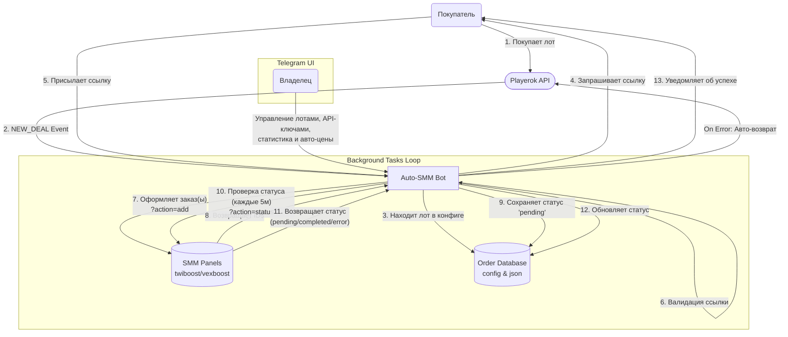

# Auto-SMM Plugin for Playerok — Implementation Plan

## Что это
Модуль для автоматической накрутки через SMM-панели (twiboost, vexboost и др.). Покупатель заказывает лот на Playerok → бот просит ссылку → оформляет заказ в SMM-сервисе → отслеживает статус → уведомляет покупателя.

## Анализ FunPay плагина (Auto SMM.py, 2701 строк)

### Архитектура и Флоу (Схема)



### Ключевые компоненты
| Компонент | Описание |
|---|---|
| **SMM Panel API** | Стандартный API: `?action=add/status/balance/refill&key=...` |
| **Multi-Service** | Словарь `services`: `{"1": {"api_url": "...", "api_key": "..."}}` |
| **Lot Mapping** | `lot_mapping`: название → `service_id` + [quantity](file:///c:/Users/yaros/Downloads/playerok_bot/Auto%20SMM.py#2204-2213) + `service_number` |
| **Order Flow** | `NEW_ORDER → ask_link → validate_link → confirm → place_order → poll_status` |
| **Status Polling** | `threading.Timer` с рекурсивной проверкой каждые 5 мин |
| **Auto-Refunds** | Автовозврат при ошибках API / невалидной ссылке |
| **Statistics** | День/неделя/месяц/всё время — заказы, сумма, чистая прибыль |
| **TG Panel** | Полная панель: лоты, API сервисы, доверенные сайты, сообщения, настройки |

### Чего НЕТ в FunPay версии (нужно добавить)
- **Несколько услуг на 1 лот** (просмотры + реакции) — user request
- **Авто-цены** с наценкой из SMM-панели — user request
- **Уведомления о неподтверждённых заказах** — user request

---

## Архитектура модуля для Playerok

### Структура файлов
```
auto_smm/
├── __init__.py              # BOT_EVENT_HANDLERS, PLAYEROK_EVENT_HANDLERS, TELEGRAM_BOT_ROUTERS
├── meta.py                  # PREFIX, VERSION, NAME
├── config.py                # SettingsFile → module_settings/config.json
├── notifications.py         # Direct HTTP к TG Bot API (как vouchers)
├── smm_client.py            # Универсальный SMM Panel API клиент
├── order_manager.py         # Хранение заказов, обновление статусов, статистика
├── background_tasks.py      # Фоновые потоки: poll статусов, авто-цены, напоминания
├── plbot/
│   ├── __init__.py
│   └── handlers.py          # on_new_deal, on_new_message (получение ссылки от покупателя)
└── tgbot/
    ├── __init__.py           # Router
    ├── _handlers.py          # on_telegram_bot_init
    ├── states.py             # FSM States
    ├── handlers.py           # /smm — главное меню
    ├── services_handlers.py  # CRUD SMM сервисов
    ├── lots_handlers.py      # CRUD лотов (с поддержкой нескольких услуг на лот)
    └── settings_handlers.py  # Доверенные сайты, сообщения, тогглы
```

---

### Ключевые решения

#### 1. Несколько услуг на 1 лот
FunPay: 1 лот = 1 service_id. Мы расширяем:

```json
{
  "lot_1": {
    "keywords": ["подписчики тг, 100"],
    "services": [
      {"service_id": 123, "quantity": 100, "service_number": 1}
    ]
  },
  "lot_2": {
    "keywords": ["просмотры + реакции"],
    "services": [
      {"service_id": 456, "quantity": 1000, "service_number": 1},
      {"service_id": 789, "quantity": 50, "service_number": 1}
    ]
  }
}
```
При покупке лота все услуги оформляются **последовательно** с одной ссылкой.

#### 2. SMM Panel API
Стандартный формат (совместим с twiboost, vexboost, smmworld и др.):
- `?action=add&service=ID&link=URL&quantity=N&key=KEY` → `{"order": 12345}`
- `?action=status&order=ID&key=KEY` → `{"status": "completed", "charge": "0.5"}`
- `?action=balance&key=KEY` → `{"balance": "10.50"}`
- `?action=refill&order=ID&key=KEY` → `{"status": 1}`

#### 3. Order Flow на Playerok
```
NEW_DEAL → match lot by keywords
         → ask buyer for link (в чат Playerok)
         → validate link (доверенные домены)
         → place order(s) in SMM panel
         → poll status every 5 min  
         → on complete: notify buyer  
         → on error: notify admin
```

> [!IMPORTANT]
> На Playerok нет `NewMessageEvent` как на FunPay (нет колбэка на каждое сообщение покупателя). Нужно уточнить: **есть ли событие нового сообщения в чате?** Если нет — ссылку придётся запрашивать через поля лота, или покупатель указывает её при покупке.

#### 4. Фоновые задачи (3 потока)
- **Status Poller**: каждые 5 мин проверяет незавершённые заказы
- **Price Updater**: каждые N сек обновляет цены на лоты = цена API + наценка
- **Confirm Reminder**: каждые N сек напоминает покупателям подтвердить заказ

---

## Proposed Changes

### Core Module

#### [NEW] [meta.py](file:///c:/Users/yaros/Downloads/playerok_bot/auto_smm/meta.py)
Метаданные: `PREFIX = "[auto-smm]"`, `VERSION = "1.0"`, `NAME = "Auto SMM"`

#### [NEW] [config.py](file:///c:/Users/yaros/Downloads/playerok_bot/auto_smm/config.py)
SettingsFile с дефолтами: `services`, `lot_mapping`, [valid_links](file:///c:/Users/yaros/Downloads/playerok_bot/Auto%20SMM.py#151-155), [messages](file:///c:/Users/yaros/Downloads/playerok_bot/Auto%20SMM.py#2287-2321), [auto_refunds](file:///c:/Users/yaros/Downloads/playerok_bot/Auto%20SMM.py#2010-2022), `price_markup`, `poll_interval`

#### [NEW] [smm_client.py](file:///c:/Users/yaros/Downloads/playerok_bot/auto_smm/smm_client.py)
Синхронный клиент: `place_order()`, `check_status()`, [get_balance()](file:///c:/Users/yaros/Downloads/playerok_bot/vouchers/api_client.py#277-279), `request_refill()`

#### [NEW] [order_manager.py](file:///c:/Users/yaros/Downloads/playerok_bot/auto_smm/order_manager.py)
JSON-хранилище заказов, статистика, обновление статусов

#### [NEW] [background_tasks.py](file:///c:/Users/yaros/Downloads/playerok_bot/auto_smm/background_tasks.py)
3 фоновых daemon потока

### Playerok Handlers

#### [NEW] [plbot/handlers.py](file:///c:/Users/yaros/Downloads/playerok_bot/auto_smm/plbot/handlers.py)
[on_new_deal](file:///c:/Users/yaros/Downloads/playerok_bot/auto_stars/plbot/handlers.py#35-127) — матчинг по keywords, запрос ссылки

### Telegram UI

#### [NEW] [tgbot/handlers.py](file:///c:/Users/yaros/Downloads/playerok_bot/auto_smm/tgbot/handlers.py)
`/smm` — главное меню с балансами сервисов и статистикой

#### [NEW] [tgbot/lots_handlers.py](file:///c:/Users/yaros/Downloads/playerok_bot/auto_smm/tgbot/lots_handlers.py)
CRUD лотов с поддержкой нескольких услуг на лот

#### [NEW] [tgbot/services_handlers.py](file:///c:/Users/yaros/Downloads/playerok_bot/auto_smm/tgbot/services_handlers.py)
CRUD SMM сервисов — URL, API Key, Balance check

---

## Verification Plan

### Automated Tests
- Запуск бота → проверка отсутствия ошибок импорта
- `/smm` в Telegram → проверка отображения меню
- Добавление сервиса → проверка баланса
- Добавление лота с 2 услугами → проверка рендера
